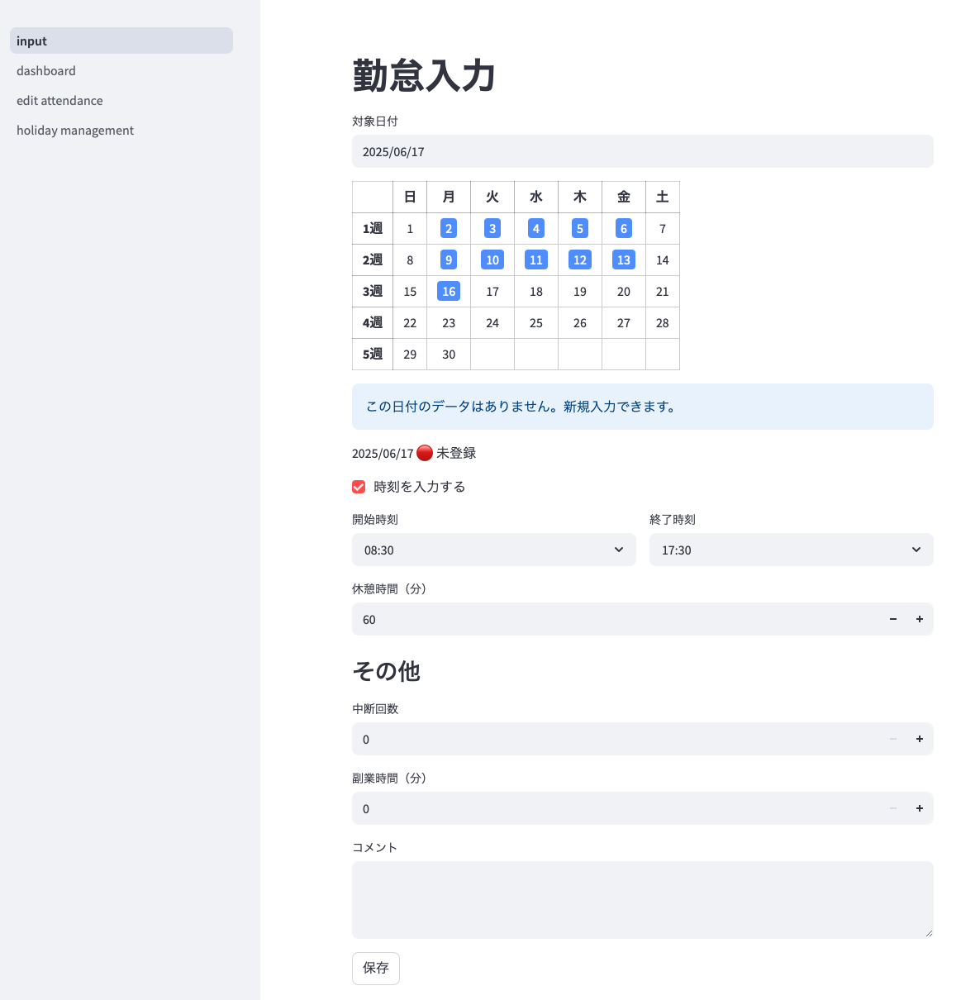
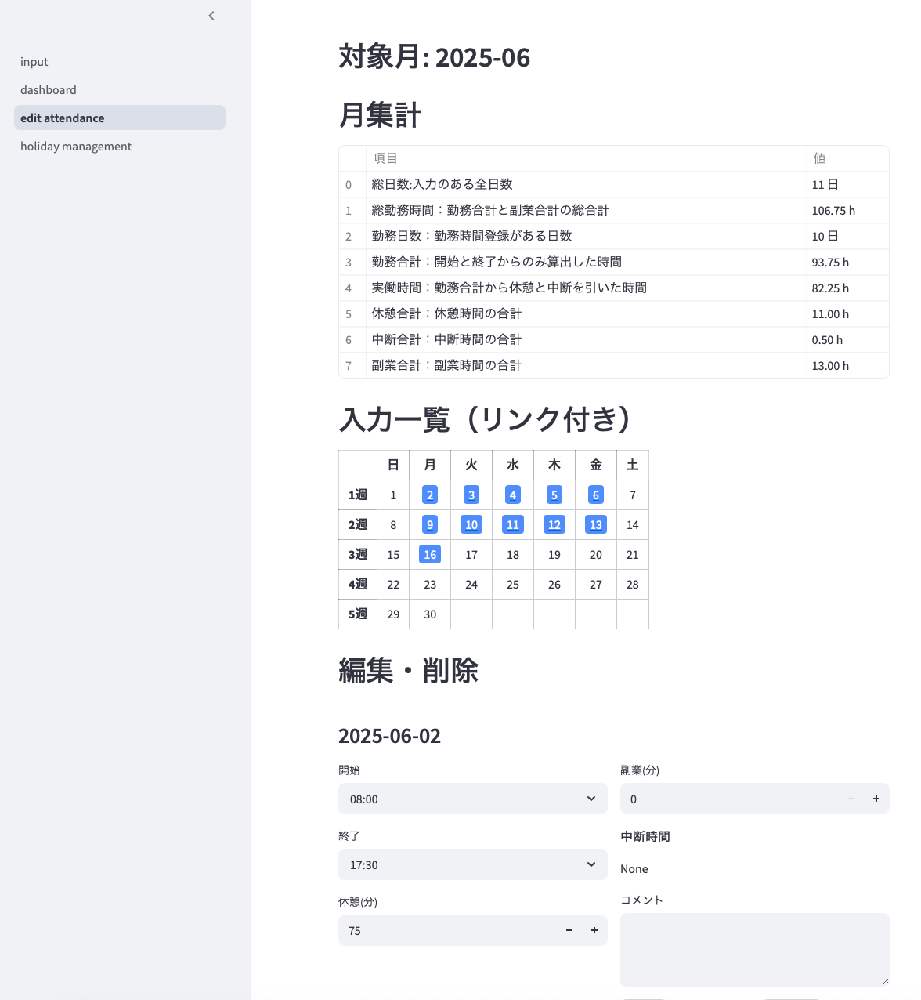
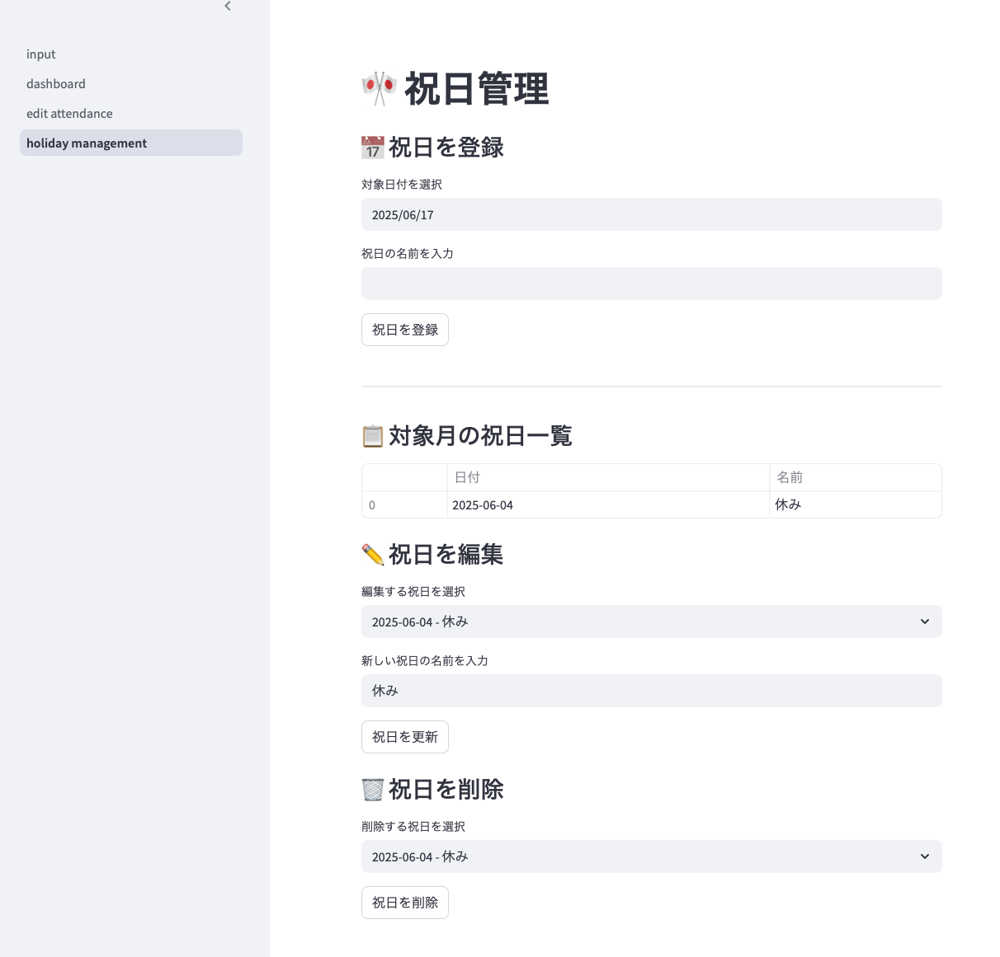
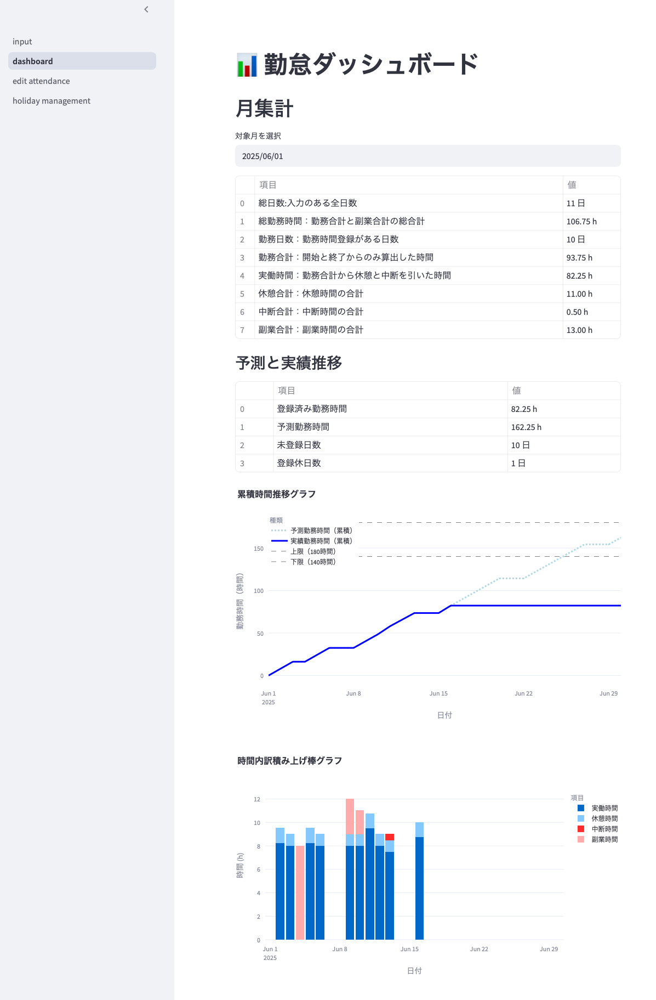

# 個人事業主向け勤怠管理システム

個人事業主を始めるにあたり、参画先、仲介会社、保育園提出様式などフォーマットが異なる時間入力に対して、時間報告しやすいように、自分向けのシステムを作っています。  
こっちは時刻、こっちは時間、こっちは休憩抜いた時間、休憩と中断は別、休憩と中断は合算、などワケワカメになってプチストレスなので、勝手に計算して表示されたものを右から左へ写せるようにしています。  
  
そのうち仲介会社へのWeb入力はSeleniumで自動にしたいですね〜。

- [個人事業主向け勤怠管理システム](#個人事業主向け勤怠管理システム)
  - [機能概略](#機能概略)
  - [使用方法](#使用方法)
  - [フォルダ構造](#フォルダ構造)
  - [ORMモデル仕様](#ormモデル仕様)
    - [AttendanceRecord（勤怠レコード）](#attendancerecord勤怠レコード)
    - [Holiday（休日管理）](#holiday休日管理)
  - [API エンドポイント仕様](#api-エンドポイント仕様)
    - [ベースURL](#ベースurl)
    - [勤怠データCRUD](#勤怠データcrud)
    - [休日管理API](#休日管理api)
    - [集計機能](#集計機能)
  - [APIスキーマ仕様](#apiスキーマ仕様)
    - [HolidayBase（休日情報 共通部）](#holidaybase休日情報-共通部)


## 機能概略

- __勤怠入力機能（input画面）__

  - 開始時刻、終了時刻、休憩時間の入力
  - 開始時刻、終了時刻、休憩時間を入力せず、副業のみを入力するケースにも対応（休日など）
  - 中断の開始と終了の入力。複数回入力できる。
    - ToDo：今の所時間の重複チェックがない。
  - 副業時間の入力。
  - 登録時に、仲介会社への入力に必要な、開始、終了、休憩合計の計算結果を表示。
  - 入力したかどうかカレンダー表示する機能。
  - 内容などのコメント入力。
- __勤怠集計、編集機能（edit画面）__

  - 入力済みデータの編集。
  - 入力済みデータの削除。
  - 1ヶ月の集計
    - 勤務日数：開始、終了に入力がある日のカウント
    - 総勤務時間：休憩、副業含めた全ての時間。保育園提出用。中断は除く。
    - 勤務合計：開始と終了からのみ算出したもの。拘束時間に該当。副業は含まない。
    - 実働時間：勤務合計から休憩と中断を除いた時間。請求工数に該当。
    - 休憩合計：休憩時間の合計
    - 中断合計：中断時間の合計
    - 副業合計：副業時間の合計
  - 入力したかどうかリンク付きでカレンダー表示する機能。クリックでその日の編集に飛べる。
- __休日管理機能（holiday_management画面）__

  - 祝日や休日を登録・編集・削除。
    - 休みを登録すると未入力日から除外され、ダッシュボードでの予測に反映される。
  - 月ごとの休日一覧を表示。
- __ダッシュボード（dashboard画面）__

  - 月別の勤務時間内訳積み重ねの推移を表示
  - 日毎の勤務時間の累積を表示
  - 1ヶ月の集計表示
  - 1年の集計表示

## 使用方法

MITライセンスです。
Dockerがインストールされていれば使えます。Pythonや必要なモジュールが自動ダウンロードされますので、インターネット環境が必要です。

- コードをローカルへ保存。フォークとかよくわからんという人はZIPダウンロードで。
- 保存したフォルダへ移動。
  - VSCodeの場合
    - ファイル → 開く → work-manager(または変更したフォルダ名)
    - ターミナル → 新しいターミナル → 下のdockerコマンド
- Docker composeを使用し起動。

```bash
docker compose up --build
```

- [http://localhost:8501](http://localhost:8501)で入力ページにアクセス。ポートが被ってる場合は変更してください。
- ルータで対象PCのIPを固定にすれば、自宅内のWiFi環境であればIP:8501でスマホなどからもアクセス可能。

## フォルダ構造

```txt
work-manager/
├── back/                        # バックエンド（FastAPI）
│   ├── database.py              # DB接続・セッション管理・Baseクラス定義
│   ├── main.py                  # FastAPIアプリのエントリーポイント
│   ├── models/                  # ORMモデル
│   │   ├── attendance.py        # 勤怠データモデル
│   │   └── holiday.py           # 休日管理モデル
│   ├── routers/                 # APIルータ
│   │   ├── attendance.py        # 勤怠データCRUD API
│   │   ├── attendance_summary.py # 勤怠集計API
│   │   └── holiday.py           # 休日管理API
│   ├── schemas/                 # Pydanticスキーマ
│   │   ├── attendance.py        # 勤怠データスキーマ
│   │   └── holiday.py           # 休日管理スキーマ
│   ├── utils/                   # 共通ユーティリティ
│   │   └── time_utils.py        # 時間関連ユーティリティ
│   ├── requirements.txt         # バックエンド依存パッケージ
│   └── Dockerfile               # バックエンド用Dockerfile
├── front/                       # フロントエンド（Streamlit）
│   ├── pages/                   # Streamlitマルチページ
│   │   ├── dashboard.py         # ダッシュボード画面
│   │   ├── edit_attendance.py   # 勤怠編集画面
│   │   └── holiday_management.py # 休日管理画面
│   ├── modules/                 # 共通ロジック・UI部品
│   │   ├── api_client.py        # API通信処理
│   │   ├── graph.py             # グラフ描画ロジック
│   │   ├── session.py           # セッション管理
│   │   └── ui_components.py     # Streamlit用UI部品
│   ├── settings.py              # API URLやデフォルト値などの設定
│   ├── requirements.txt         # フロント依存パッケージ
│   └── Dockerfile               # フロント用Dockerfile
├── docker-compose.yml           # Docker一括起動構成
├── README.md                    # プロジェクト概要・利用方法
├── LICENSE                      # ライセンス
└── .gitignore                   # Git管理除外ファイル
```

## ORMモデル仕様

### AttendanceRecord（勤怠レコード）

| カラム名          | 型         | 説明                                         | 制約                   |
|-------------------|------------|----------------------------------------------|------------------------|
| id                | Integer    | 主キー（自動採番）                           | primary_key, index     |
| date              | Date       | 勤怠対象日                                   | index, not null, unique|
| start_time        | String     | 勤務開始時刻（例: "09:00"）                  | nullable               |
| end_time          | String     | 勤務終了時刻（例: "18:00"）                  | nullable               |
| break_minutes     | Integer    | 休憩時間（分単位）                           | nullable               |
| interruptions     | JSON       | 中断時間リスト（例: [{"start": "12:00", "end": "13:00"}, ...]） | nullable               |
| side_job_minutes  | Integer    | 副業時間（分単位）                           | nullable               |
| updated_at        | DateTime   | 最終更新日時（レコード作成・更新時に自動設定）| default/auto-update    |
| comment           | String     | コメント・備考欄                              | nullable               |

### Holiday（休日管理）

| カラム名          | 型         | 説明                                         | 制約                   |
|-------------------|------------|----------------------------------------------|------------------------|
| id                | Integer    | 主キー（自動採番）                           | primary_key, index     |
| date              | Date       | 休日の日付                                   | index, not null, unique|
| name              | String     | 休日の名前（例: "元日", "建国記念の日"）      | nullable               |

## API エンドポイント仕様

### ベースURL

```txt
http://<host>:8000/api
```

### 勤怠データCRUD

| メソッド | パス                                         | 概要                       | 主なレスポンス         |
|----------|----------------------------------------------|----------------------------|------------------------|
| GET      | /attendance/{record_date}                    | 指定日の勤怠データ取得      | AttendanceOut          |
| POST     | /attendance/{record_date}                    | 指定日の勤怠データ作成/更新 | AttendanceOut          |
| DELETE   | /attendance/{record_date}                    | 指定日の勤怠データ削除      | {"detail": "Deleted"}  |
| GET      | /attendance/month/{year_month}               | 指定月の勤怠データ一覧取得  | List[AttendanceOut]    |

### 休日管理API

| メソッド | パス                                         | 概要                       | 主なレスポンス         |
|----------|----------------------------------------------|----------------------------|------------------------|
| GET      | /holidays/                                   | 全ての休日を取得            | List[HolidayOut]       |
| GET      | /holidays/{year_month}                       | 指定月の休日を取得          | List[HolidayOut]       |
| POST     | /holidays/                                   | 新しい休日を登録            | HolidayOut             |
| PUT      | /holidays/{holiday_date}                     | 指定日の休日を更新          | HolidayOut             |
| DELETE   | /holidays/{holiday_date}                     | 指定日の休日を削除          | {"detail": "Deleted"}  |

### 集計機能

| メソッド | パス                                         | 概要                       | 主なレスポンス         |
|----------|----------------------------------------------|----------------------------|------------------------|
| GET      | /attendance/summary/daily/{record_date}      | 指定日の集計データ取得      | AttendanceDaySummaryResponse |
| GET      | /attendance/summary/monthly/{year_month}     | 指定月の集計データ取得      | List[AttendanceDaySummaryResponse] |
| GET      | /attendance/summary/monthly-agg/{year_month} | 指定月の集計結果取得        | MonthlyAggregateSummary |

## APIスキーマ仕様

### HolidayBase（休日情報 共通部）

| フィールド名 | 型   | 説明                         | 必須 |
|--------------|------|------------------------------|------|
| date         | date | 休日の日付                   | ○    |
| name         | str  | 休日の名前                   | ○    |

